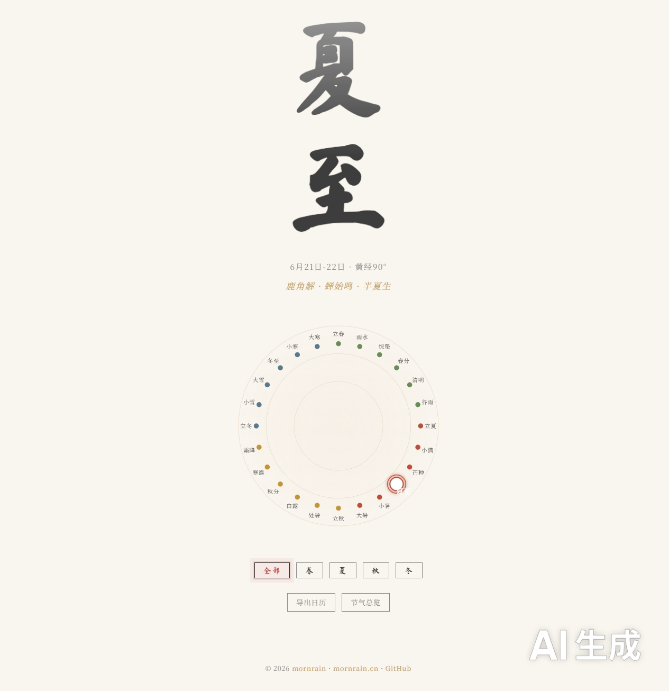
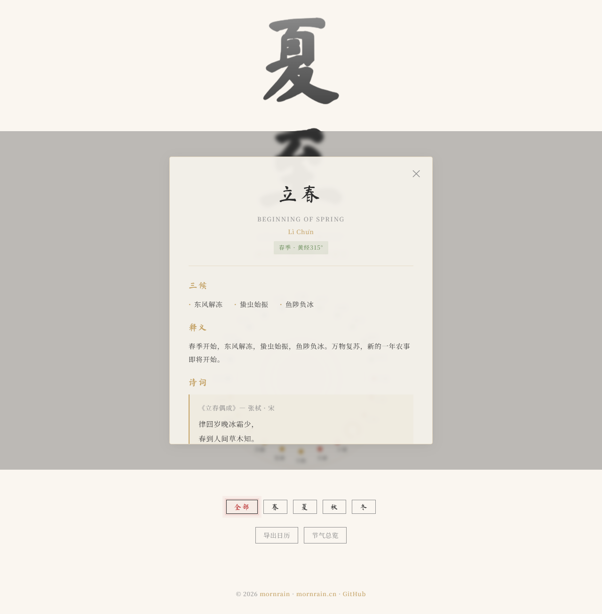

# Solar �二�四节气数字画�| by mornrain-lin

> *"A digital art piece that brings the ancient Chinese calendar to life through ink-wash aesthetics and modern web technology."*

[](LICENSE)
[](app.js)
[]()
[]()

**开��*: [mornrain-lin](https://github.com/mornrain-lin)
**网站**: [mornrain.com](https://mornrain.com) | [mornrain.cn](https://mornrain.cn)

Solar 是一个�简纯粹的二�四节气数字艺术项目。它将中国传统水墨�学�入交互� Web 体验，以 Canvas 粒�水墨背景�SVG 节气圆轮和精�的节气详情�片，呈�东方文化的诗��韵律�
## 文化背景

二�四节气起��黄河�域，是中国�代农耕文�的智慧结晶。它将太阳周年视�动轨迹划分�24 等份，� 15° 为一节气，精准�映了季节�物候�气候的�化规律�016 年，"二�四节�被正�列入��国教科文组织人类�物质文化�产代表作�录，�为世界公认的时间知识体系�
> **在线体验**: [https://mornrain.com/solar](https://mornrain.com/solar)

## �Features

- � **水墨粒�背景** �数百粒�模拟水墨晕染，颜色�季节�化，鼠标微弱交互，30fps �畅�行
- ☀�**节气圆轮** �24 节点�形�列，四季�色，当�节气高亮脉冲，hover 放大
- 📜 **节气详情�片** �毛�璃弹窗，三候�诗��农谚��食�养生一应俱�- 🌸 **四季筛�* �一键切�春/��冬，节点平滑过渡
- 📷 **导出日�** �Canvas 绘制精�节气�片并导出为 PNG
- 🗓�**72候完整数�* ��个节气的三候物候�象，�自《月令七�二候集解�- 🖼�**节气�片导出** �Canvas 绘制精�节气�片，一键导�PNG 分享
- ⌨� **键盘导航** ���切�节气，Esc 关闭弹窗，�畅��- � **iCal 日�** �导出全年24节气事件到系统日�- 📱 **完��应�* �桌� �平� �手机三档适�
- 🚫 **零��* ��HTML/CSS/JS，�引入任何框�或库（Google Fonts 除外�- � **完整 SEO** �Open Graph�Twitter Card�语义化标签
- 🖋�**东方�学** �Ma Shan Zheng 书法字体 + Noto Serif SC 衬线体，呼�动画，留白呼�感

## 📸 Screenshots

<!-- TODO: Add hero screenshot -->


<!-- TODO: Add wheel screenshot -->


<!-- TODO: Add detail card screenshot -->


<!-- TODO: Add mobile screenshot -->


## 🚀 Quick Start

直�打开 `index.html` ��，无需�建�编译或安装任何�赖�
```bash
# 克隆仓库
git clone https://github.com/mornrain-lin/solar.git
cd solar

# 用任�HTTP �务器打开（�选）
# Python 3
python -m http.server 8080

# 或直���index.html
```

## 🛠�Tech Stack

| 技�| 用�|
|------|------|
| HTML5 Canvas | 水墨粒�背景动画 |
| SVG | 节气圆轮矢�图形 |
| CSS3 | 动画�毛�璃��应�布局 |
| Vanilla JavaScript | 全部交互逻辑 |
| Google Fonts | Ma Shan Zheng + Noto Serif SC |

## � Project Structure

```
solar/
├── index.html      # 主页�，三层结�
├── style.css       # 东方水墨�学样�
├── app.js          # 核心交互逻辑
├── data.js         # 二�四节气完整数�集
├── favicon.svg     # �简节气图标
├── README.md       # 项目文档
└── LICENSE         # MIT 许��```

## 📖 Data Coverage

24 个节气，�个包��- 中英文�称�拼音�所�季�- 黄�度数�日期范�- 节气释义
- 三候（物候�象）
- �典诗�（�标题�作者��代�全文）
- 农谚
- 时令�食
- 养生建议
- 气候特�
## � Acknowledgments

- 节气数��考《月令七�二候集解》�相关典�
- 书法字体 [Ma Shan Zheng](https://fonts.google.com/specimen/Ma+Shan+Zheng) by Google Fonts
- 衬线字体 [Noto Serif SC](https://fonts.google.com/specimen/Noto+Serif+SC) by Google Fonts
- 水墨�学�感�自中国传统山水�
## â­?Star History

<!-- TODO: Add star history chart -->
[](https://star-history.com/#mornrain-lin/solar&Date)

## 📄 License

MIT © 2026 mornrain-lin 贡献�